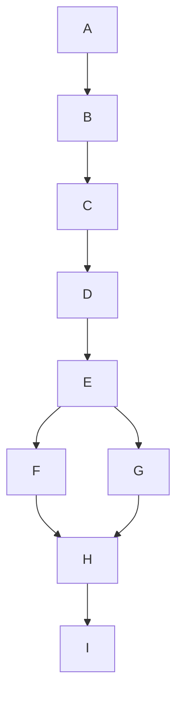

# Market report performance and database time plan

Date: 2026-10-06 (Europe/Lisbon).
Status: phases A-I complete and integration verified on 2026-10-06. Final suite:
736 passed in 74.62s, no skips; real-browser focused checks: 88 passed in 58.31s.
Evidence and requirements-to-test mapping:
[phase-I handoff](market-report-performance-handoffs/phase-i.md).
The reported outside-column PNG strip remains unreproduced in the checked cases;
no cause/fix is claimed for it. One reproduced participant-header text overlap
was fixed with intrinsic numeric-header sizing and a browser regression.
No production sync, migration, database modification, publication or rollout ran.
Execution prompts: [market-report-performance-prompts.md](market-report-performance-prompts.md).

## Scope and decisions

This plan covers the six requested changes: bounded participant processing,
separate sync/report workflows, database-derived analysis dates, tight table PNGs,
query/index optimization, and cumulative 80% participant detail selection.

Confirmed by the user:

- The analysis clock is the newest timestamp represented by stored market data,
  across items and streams. It is not the insertion/download time of an old row.
- Ordinary reports and entity queries use window-only activity. Full-history FIFO
  accounting is available on explicit request, rather than running automatically.
- Detail tables should include the leading rows needed to reach at least 80% of
  each entity's monetary turnover, instead of stopping at ten detail rows.
- Existing chart starts must continue to include entire intervals.

Working interpretation (not separately confirmed):

- The requested two commands are API-to-SQLite sync and SQLite-to-report
  generation: `--sync`, `--from-db`, and `--live` composing both. The original
  wording said "download and import." The clarification about a separate
  file-download/file-import workflow has not been answered. Phase A uses the
  stated sync/report assumption unless the user corrects it; sending prompt A
  authorizes that scoped interpretation without another confirmation round.
  Do not invent a staged raw-JSON download pipeline. If the user requests file
  download/import instead, revise the plan and downstream contracts first.

Other choices below are implementation specifications proposed by this document,
not additional choices already confirmed by the user. Executing the relevant
prompt authorizes its bounded implementation; preparing these files does not
start application changes, API sync, production migration, or publication.

This plan supersedes earlier instructions to show every category in published
participant detail tables, and to calculate full FIFO automatically. Complete
window activity remains available in CSVs. Preserve other established requirements
in [AGENTS.md](../AGENTS.md), including official identities/icons, equipment
signature distinctions, static PNG publication, and architecture boundaries.

## Findings from investigation

- `cli.py::main` captures `report_as_of` from wall-clock time before sync. It
  repeats DB report preparation in the live and offline branches.
- `sync.py::sync_market_data` is already the shared sync implementation. Its
  incremental, resync, backfill, and resume behavior should stay centralized.
- `market_store.py::participant_history_query` first identifies references in
  the seven-day window, then retrieves those references' older history. That
  history is used by `calculate_participant_rankings` for FIFO inventory costing.
  SQL already filters the active window; the costly expansion is intentional
  accounting behavior, not simply a missing initial Python filter.
- `--player-summary` currently builds the entire participant report before
  selecting one user.
- `last_market_sync_at` already exists, but records a sync anchor and status. Its
  legacy inference examines price/order observations, not transactions. It is
  distinct from the required global data clock.
- Several market read methods apply a lower date bound without an upper bound.
  Historical `--as-of` can therefore admit later rows in some calculations. Fix
  this while introducing the shared clock.
- `metrics.py` keeps complete `item_categories`, then assigns
  `top_items = item_categories[:10]`. These are aggregated commodity/equipment
  categories, not ten individual raw trades. The entity leaderboards also have
  a top-ten limit, which is a separate requirement and stays unchanged.
- Read-only `EXPLAIN QUERY PLAN` showed existing participant-reference indexes
  being used. Per-item transaction history selected the type/time index, leaving
  the item predicate as a filter. Candidate history deduplication and exact
  timestamp sorting use temporary B-trees. Latest-order selection ranks the
  observation history. These are candidates for measurement, not proof of the
  optimal replacement indexes.
- The production database was approximately 11.2 GB during investigation. Index
  size, creation time, and ingestion overhead matter alongside read performance.
- The three existing PNGs and fresh browser rendering did not reproduce a right
  strip: the last cells ended within the normal 0.5 CSS-pixel table border. Current
  export checks detect overflow/clipping, but do not detect unused right space.

## Common constraints

1. Keep SQLite access and SQL in `market_store.py`, API endpoint parsing in
   `warera_api.py`, HTTP in `api_client.py`, calculations in `metrics.py`, and
   rendering in `report.py`/`charts.py`. Read models remain in `market_data.py`.
2. Extract reusable methods rather than copying report, query, or account
   attribution logic. A workflow module may orchestrate existing layers; it must
   not move SQL, formulas, API payload parsing, or rendering into itself.
3. Use the existing `.venv`. Tests use isolated temporary databases/output paths.
   Coding prompts do not authorize live API collection or production migrations.
   Production profiling is read-only and must not call initialization/migration
   helpers that can write. No production DDL/DML or manual version-marker edits.
4. Add schema/index changes only as new migrations through `initialize()`.
   Update both fresh-install and upgrade tests and every affected schema assertion.
   Do not edit an already released migration to introduce a new change.
5. Preserve unrelated work. Follow the safe Git rules in AGENTS.md. Do not commit,
   sync branches, launch other agents, or start the next phase unless instructed.
6. Missing money, quantity, fees, cost basis, and source coverage remain explicit.
   Never manufacture facts or turn an unknown amount into zero.
7. Do not create a website/interface as part of this work. Supply reusable entity
   query/read-model methods that an interface can call; wire the existing CLI.
8. Reserve README and shared planning-document edits for phase I. Each earlier
   phase writes only its own handoff note and changes its assigned code/tests.

## R1: Bounded participant activity and optional FIFO

Ordinary DB reports, player summaries, and reusable entity activity queries must
read only transactions inside their resolved activity window. Apply both bounds
in SQL before parent rows, child facts, or Python domain records are materialized.
Keep batched child reads; do not replace them with one query per transaction.

Use one explicit accounting option:

```text
--participant-accounting window       # default
--participant-accounting full-fifo    # explicit earlier-history replay
```

The read-model equivalent accepts the same mode. Keep the existing chronological
full-history iterator for the explicit mode. Earlier transactions may affect
cost basis in that mode, but must never add to window turnover or activity counts.
Do not implement persisted inventory/checkpoints in this project phase.

Separate window aggregation and history accounting into reusable calculation
helpers. Do not copy the entire current reducer. In window mode, do not run the
inventory replay even on the window rows and present it as full FIFO. Return
explicit accounting metadata such as `accounting_mode` and `accounting_status`;
matched realized P&L and historical inventory diagnostics are unavailable when
not calculated. Retain export columns where practical, using unavailable values
and status instead of fabricated numbers. Diagnostic exports must not secretly
trigger full-history reads in default mode.

Current detail rows also contain buy/sell average-price comparisons and unmatched
window quantities. These describe the window and are not full realized profit or
total holdings. Preserve their arithmetic where valid, but label them accordingly
or show them as unavailable where their label would imply FIFO accounting.
Full-FIFO mode does not turn a window-average comparison into realized P&L.

Preserve account ownership rules, self-trade treatment, unresolved attribution,
equipment variants, exact arithmetic, equal-time conventions, and source-money
versus verified-gross basis. Current profile membership must not change historical
transaction attribution.

Acceptance:

- A recent window containing N eligible parents yields N parents to the default
  reducer even when many old rows involve those same entities.
- Adding old history does not increase default Python processing/child reads.
- Full-FIFO mode still consumes earlier buys AND sells when costing recent sales.
- Default reports never claim that skipped accounting was performed.
- Window totals/categories agree with the old implementation's window aggregates
  on a fixed fixture; accounting availability is the intentional difference.

## R2: Separate sync and report workflows

Under the command interpretation above, expose two reusable workflows:

| Entry point | Responsibility | Network behavior |
| --- | --- | --- |
| `--sync` | Collect normalized API facts into SQLite, then exit | Existing paced API sync |
| `--from-db` | Read SQLite, calculate, render, and export | Offline by default |
| `--live` | Call sync once, then the same DB report workflow | Sync plus existing explicitly scoped identity refresh |

`--live` must not have a separate report implementation or bypass the shared sync.
Preserve current identity-refresh behavior through a separately named enrichment
step/options; a profile refresh does not move the market data clock. Plain
`--from-db` remains offline. Explicit user-name resolution may preserve the
existing exact-name public lookup when absent from cache, without fetching market
history. CSV/custom-endpoint compatibility remains outside DB clock semantics.

Incremental sync, recent/all-history resync, resume, and legacy backfill remain
options of the same sync service. Preserve existing page/cursor/coverage contracts,
error and partial-sync handling, progress output, and incompatible-argument checks.
Do not alter partial-sync publication policy opportunistically.

Report preparation should return a coherent result/context consumed by rendering,
with the same options for either entry point. Do not invoke `main()` recursively
or spawn a second CLI process to share implementation.

Acceptance:

- `--sync` never prepares or publishes a report.
- `--from-db` does not call market API or sync functions.
- `--live` calls the same sync and report functions, in that order, once each.
- Given the same database, options, and resolved cutoff, live/offline report
  preparation yields equivalent market/participant/chart inputs.

## R3: Global database clock and consistent periods

### Timestamp authority and storage

Add dedicated application metadata in a new migration, separate from schema
version markers and existing sync-status metadata. Suggested table:
`market_data_metadata`, with one global `data_as_of_us` value in UTC microseconds.
The implementation may choose an equivalent typed schema; publish its contract
in the phase-B handoff. The timestamp is the maximum of retained:

- Completed transaction `created_at`/`created_at_us`, including legacy rows,
  commodities, equipment, unfamiliar item codes, and either market stream.
- Price observation `observed_at`.
- Order-book observation `observed_at`.

Use source timestamps, not `updated_at`, `fetched_at`, `last_fetched_at`, page
receipt, sync start/finish, or wall-clock time. Profile/assets, production-point
configuration, ingestion progress, migration, housekeeping execution, and report
generation are administrative facts and do not independently advance this clock.
Price observations may contribute to the clock without becoming trading evidence.

Seed existing databases once through the migration, including transaction-only
databases and legacy precision. Empty databases have an unavailable clock. Read
methods do not lazily write or repeatedly scan all historical records for MAX.
Prefer indexed newest candidates during bootstrap; measure one-time work.

Maintain the clock inside the same transactions as eligible market-fact writes,
including direct store ingestion methods, legacy upserts, and every sync mode.
Rejected/rolled-back pages cannot advance it. Partial syncs may advance it only
to facts actually committed; partial/coverage status stays separate. Old-history
replay does not regress it. A newer real observation can advance it even if
transaction IDs are unchanged. An unchanged replay advances nothing by itself.

Backups include the metadata. Supported restore/reconciliation paths must leave
it consistent with retained market facts. Pruning must not leave a timestamp for
a newest fact that no longer exists; use the store's supported maintenance path,
without a history-wide MAX scan on each ordinary read. No concurrent production
writer or manual schema operation is part of this implementation.

### Shared report context and boundaries

Represent timestamp authority explicitly. Suggested context fields:

```text
data_as_of              # C: newest stored market timestamp
requested_as_of         # optional user-supplied cutoff
analysis_as_of          # common reference for dates/chart axes
window_end_exclusive    # SQL/reducer boundary, separate from axis/reference
generated_at            # actual report creation time
accounting_mode         # window or full-fifo
```

Do not reuse `generated_at` or `last_market_sync_at` as the analysis clock.
Resolve and freeze this context once after sync/enrichment and before data reads.
Reopening a store for charts must not resolve a different cutoff. Capture/read a
consistent database state where practical; do not claim that live pagination
provides a server snapshot. Plain DB callers with no supplied cutoff use the same
resolver instead of defaulting independently to `datetime.now()`.

Boundary specification:

- Default: `analysis_as_of = C`; a 7D activity window includes
  `[C - 7 days, C]`. Query it as `[C - 7 days, C + 1 microsecond)` so the newest
  transaction is included without truncating subsecond precision.
- Explicit historical `--as-of T` with `T <= C`: preserve the existing reproducible
  `[T - 7 days, T)` contract. Reference/axis end is T.
- Requested T later than C: clamp to the default database ceiling C, report the
  effective cutoff, and use the default inclusion rule. Do not analyze an empty
  future period or silently use now.
- Start dates derive from `analysis_as_of`, not from the technical exclusive bound.
  Never shift the start by one microsecond when adding the inclusion epsilon.
- Source-coverage evaluation and displayed dates use the logical reference C/T,
  not the technical epsilon. Do not mark otherwise adequate coverage incomplete
  solely because the SQL upper bound includes one extra microsecond.
- Empty DB: return explicit empty/unavailable outputs or the existing clear
  no-data result. Do not invent a wall-clock cutoff or charts with fabricated data.
- Timestamp normalization is UTC and offset-aware. Handle legacy NULL
  `created_at_us` without losing source microseconds.

For chart interval I and display period P:

```text
chart_start = existing_interval_floor(analysis_as_of - P, I)
chart_end   = analysis_as_of
```

Preserve supported intervals and partial-candle behavior. Do not round the end
to a completed candle or change the selected interval. WE24 keeps its fixed
inception, weighting rules, and exclusion of the unfinished UTC day; "unfinished"
is assessed relative to the shared analysis cutoff.

Apply the clock and upper bounds to market rows, 1D/7D/30D references, trends,
forecast inputs/evaluation, action costs, participant/equipment exports, highlight
charts, all-item/research charts, and current DB workflow helpers. Keep snapshot
quote/name semantics of historical `--as-of` transparent: it does not promise to
rewind cached identities or latest executable orders. Rows after the effective
cutoff must not enter historical trade statistics or backtests.

`scripts/market_rollout.py` must freeze the clock from its report snapshot rather
than now. Preserve explicit historical boundaries when resuming older jobs. Carry
boundary mode and effective context in job/publication metadata so verification
does not accidentally convert a default inclusive endpoint into explicit
half-open `--as-of`. Update `verify_market_publication.py` to reconstruct the
same context and accounting mode.

Acceptance includes stale DBs with a mocked wall clock far ahead, transaction-only
and empty DBs, newest timestamps from any item/stream/observation kind, duplicate
replay, older import, committed partial pages, rollback, exact cutoff/start ties,
future clamping, historical overrides, interval flooring, and snapshot resume.

## R4: Tight and complete table PNGs

Investigate Trading Guide, Current Order Book, and Activity Comparison through
the same exporter used for participant tables. Inspect raw pre-export HTML,
computed CSS, table/thead/tbody/tr/cell bounds, column counts, `colspan`, footer
width contribution, and resulting PNG edges. A wrapper width or the last text's
position is not the table's actual column boundary.

Keep capture on `table.report-table`. Do not solve unused table space by clipping
pixels, screenshotting only body cells, hiding content, shrinking fonts, forcing
a fixed width, or adding scrolling. Correct the DOM/CSS/column sizing if a defect
is found. Preserve intentional cell padding, borders, bar tracks, and legitimate
last-column whitespace needed by other rows.

Extend geometry validation/inventory with right-edge evidence comparing table
and last header/body cells, allowing documented border/fractional-pixel rounding.
Validate PNG canvas dimensions against the measured complete table. The check
must cover unused space outside the real columns, not enforce that every text
string fills its cell. Avoid false alarms from multirow headers, empty states,
valid spanning cells, or collapsed borders.

Add representative real-browser regressions for all three old tables and the
participant tables, long labels, sparse rows, and footer/span variants. Review
actual PNGs at readable size. If the reported strip cannot be reproduced, say so
and document the checked cases; do not claim an unobserved cause was fixed.

## R5: Query and index optimization

Profile the final phase-E queries before changing indexes. Record query name,
window/entity inputs, parent rows read, child-query count, elapsed time, and
`EXPLAIN QUERY PLAN`. Distinguish full/index scans, selective searches, residual
filters, temporary sorting, and required grouping. An index appearing in EXPLAIN
does not prove a query is selective or fast.

Candidates to test, not unconditional DDL requirements:

| Query | Candidate improvement |
| --- | --- |
| Per-item trade windows and daily aggregates | Composite `(transaction_type, item_code, created_at_epoch, id)` or equivalent selective index |
| Exact participant/equipment time windows | Indexed precise timestamp strategy that also handles legacy rows; avoid blindly indexing a custom function |
| Exact user ID or case-insensitive name | Split ID/name lookup if needed and an index matching actual `COLLATE NOCASE` semantics |
| Latest observation per item | Indexed per-item newest-row seeks instead of ranking every retained observation; preserve time/ID ties |
| Item discovery | Use distinct item/type access rather than scanning unrelated historical parent data |
| Explicit FIFO history | Preserve reference indexes and assess candidate expansion; do not optimize it by omitting old dispositions |

Try query rewrites and removal of unnecessary reads before adding wide indexes.
Preserve row ordering, decimal evidence, microsecond boundaries, account ownership,
and supported SQLite behavior. Do not introduce denormalized participant ownership
or a new data cache solely for this task. Existing foreign-key/child indexes
already have useful leading keys; do not duplicate them without evidence.

Measure a fixture with many old rows and a small active window, multiple items,
and repeated active entities. Run result-equivalence tests. Timing checks should
record measurements rather than rely on brittle absolute time assertions; stable
tests should assert bounded row counts, batched reads, and meaningful query-plan
properties. Record cache conditions and fixture size for benchmarks.

Keep only changes with evidence. Add retained indexes in the next migration after
phase B (baseline is schema v6; do not assume a number if other work advanced it).
Measure upgrade time, added storage, and ingestion impact on a disposable DB.
Do not run CREATE INDEX, ANALYZE, VACUUM, or schema changes on production for
profiling. Store measured findings in the phase-G handoff.

## R6: Cumulative 80% detail selection

Entity leaderboard populations remain the existing top ten users, MUs, and
countries by monetary turnover. For each selected entity, detail lines are
aggregated item/equipment categories with buy and sell combined.

Use the same money basis as the entity's turnover:

```text
row_volume   = buy_total_value + sell_total_value
entity_total = same-basis entity monetary turnover
threshold    = entity_total * 4 / 5
```

Sort by descending row volume with a deterministic category-signature tie break.
Select the shortest prefix whose cumulative volume reaches/exceeds the threshold.
Include the crossing row and stop. No maximum row count; do not include all equal
ties after the threshold unless needed to reach it. Use existing exact arithmetic
(Fraction/Decimal), not rounded display values or binary-float thresholds.

| Entity total | Ordered row volumes | Selected rows |
| --- | --- | --- |
| 100M | 80M, 10M, 10M | First row only |
| 100M | 79M, 11M, 10M | First two rows |
| 100M | 100 equal 1M rows | First 80 rows, not ten |
| 100M | 50M, 30M, 20M | First two rows |

Keep full `item_categories` and per-side categories for complete window CSVs.
`top_items` may remain the compatibility display key, but its meaning becomes
the selected prefix. Publish `detail_selection` metadata containing threshold,
selected turnover/share/count, total row count, and completeness/status as useful.
Reuse the same helper for all three entity kinds and targeted CLI detail display.
Compact top-three Bought/Sold leaderboard summaries may stay unchanged.

If money is missing and the true denominator is unknown, keep all affected
entity detail rows and mark coverage unknown/partial. Do not claim 80% of an
unverified total. A known zero total has no qualifying positive-volume prefix;
retain explicit no-activity/zero-total handling. Zero/missing rows must not cause
an infinite loop or divide-by-zero. Assert that complete categories reconcile
to the entity denominator; investigate mismatches rather than silently selecting
against a different basis.

Preserve distinct equipment signatures even when display labels are identical.
Keep icons, identities, safe escaping, CSV protection/precision, and unavailable
cells. If showing a coverage note, place it in report context rather than adding
large footer bands or changing table-only capture semantics.

## Execution schedule and ownership

Dependencies include both data/API prerequisites and shared-file collisions.
Completing only part of a predecessor is not sufficient to start its dependent.

| Phase | Deliverable | Must finish first | Main edit ownership |
| --- | --- | --- | --- |
| A | Shared sync/report command workflows | None; uses documented command assumption | `cli.py`, optional workflow module, CLI tests |
| B | Global data-clock migration and atomic maintenance | A | `market_store.py`, `sync.py`, clock/store/sync/migration tests and schema assertions |
| C | Shared cutoff context, upper bounds, charts/exports/runner | B | CLI/workflow, `market_data.py`, necessary store bounds, domain context, render timestamp plumbing, charts, runner/verification and focused tests |
| D | Window-only activity with explicit full FIFO | C | `market_store.py`, `market_data.py`, `metrics.py`, CLI option, affected accounting presentation/exports, participant/CLI tests |
| E | Direct entity queries and resolve-before-analysis | D | `market_store.py`, `market_data.py`, `cli.py`, targeted-query/CLI tests |
| F | Exact cumulative 80% selection | E | `metrics.py`, `report.py`, `tests/test_participant_metrics.py`, `tests/test_participant_report.py` |
| G | Measured query/index optimization | E | `market_store.py`, store/query/migration tests, schema-version assertions including identity tests |
| H | PNG investigation, layout repair, geometry checks | F AND G | `report.py`, browser export tests, identity export tests only as necessary |
| I | Integration, user docs, final requirements review | H | README, this plan's status, rendering contract, cross-layer tests/verification; minimal integration fixes |

Recommended execution waves:

```text
1: A alone (uses documented sync/report interpretation)
2: B alone
3: C alone
4: D alone
5: E alone
6: F and G may run in parallel, subject to the rules below
7: H alone, after BOTH F and G have finished
8: I alone
```



Only F and G are authorized as an implementation parallel pair by this schedule.
They do not depend on each other's changes. This is safe only if:

- E is complete and its entity/category contracts are stable.
- F edits only its listed metrics/rendering/test files; G edits only its listed
  store/migration/query-test files. Neither edits README, CLI, `market_data.py`,
  shared prompts, or the other's fixtures. A needed cross-scope change makes
  this wave sequential; report that conflict before either edits the shared file.
- Each uses unique temporary databases/output directories and a unique handoff
  note. Neither migrates, syncs, or publishes against the production database.
- Neither starts H or I, runs a shared publication job, or stages/commits while
  the other is active. Run final integration checks after both finish.

If ownership cannot be kept disjoint, use F then G. This is the safest default
for two processes sharing one checkout. All other implementation phases are
sequential. No background task from a predecessor may still be modifying files
or output when its dependent begins.

Each phase writes `docs/market-report-performance-handoffs/phase-X.md` (lowercase
letter in filename). Include changed files, public signatures/data fields, test
commands/results, known limitations, and evidence that acceptance requirements
were met. B records the schema version; C records boundary/context contracts;
D records default/export accounting semantics; E records targeted ownership
behavior; F/G record disjoint ownership if running together. A phase is complete
only when required focused tests pass and its handoff is available. If blocked,
mark the handoff incomplete and do not start dependent phases.

## Final verification and completion criteria

Verification completed in phase I against all nine examples below, including
real offline CLI/browser/publication verification for both boundary modes and
both accounting modes, atomic clock/migration rollback, bounded/targeted activity,
exact selection and complete CSVs. The handoff records final test commands,
disposable measurements, compatibility changes and remaining limitations. This
status reflects rerun checks and inspected artifacts, not just A-H completion
claims. Production deployment and production-size migration timing remain outside
this completed integration scope.

Phase I runs the appropriate full suite once using `.venv/Scripts/pytest` after
focused phase checks have passed. Use real-browser tests with the supported local
browser and isolated output. Do not silently skip browser checks and claim that
PNG requirements passed. Investigate failures without broad unrelated rewrites.

Required integration examples:

1. A stale database generates the same analysis periods with the wall clock
   advanced weeks later; only `generated_at` changes.
2. Sync then report and report from the resulting DB share one context and output
   inputs. Sync alone produces no report artifacts; ordinary DB reports are offline.
3. A newest trade exactly at C appears in default activity. Historical explicit
   T preserves end exclusion. Trades before start or after the effective upper
   bound do not leak into statistics or charts.
4. Increasing old history leaves default activity processing bounded. Full-FIFO
   mode retains correct earlier-disposition behavior and availability labels.
5. Targeted user/MU/country results match that entity's full-window aggregation
   without calculating all other entities. Ambiguous names and actor ownership
   remain explicit.
6. Every entity kind passes 80M, 79M, many-small-row, deterministic tie, decimal,
   missing-value, empty, and zero-total selection cases. CSVs retain omitted
   window categories; the displayed entity population stays top ten.
7. Fresh installs and upgrades through both new migrations keep version markers
   synchronized. Atomic rollback includes facts and clock. Measured query results
   remain identical; no benchmark depends on a hard-coded fast machine.
8. All table captures contain the complete table, no unused strip beyond actual
   columns, and legible text. Inventory and replacement HTML refer only to
   current-run assets. Record any still-unreproduced visual report honestly.
9. Rollout snapshot/resume and publication verification use the same effective
   clock, endpoint mode, and accounting mode instead of reconstructing now.

Update README command examples, clock/boundary descriptions, accounting-mode
semantics, 80% display behavior, and the participant rendering contract. Preserve
diagnostic schemas where practical and explain intentional availability changes.
Finish with a requirement-by-requirement result, tests, measured performance,
migration implications, and unresolved issues. Do not mark a phase or the project
complete merely because its agent ran out of budget.
