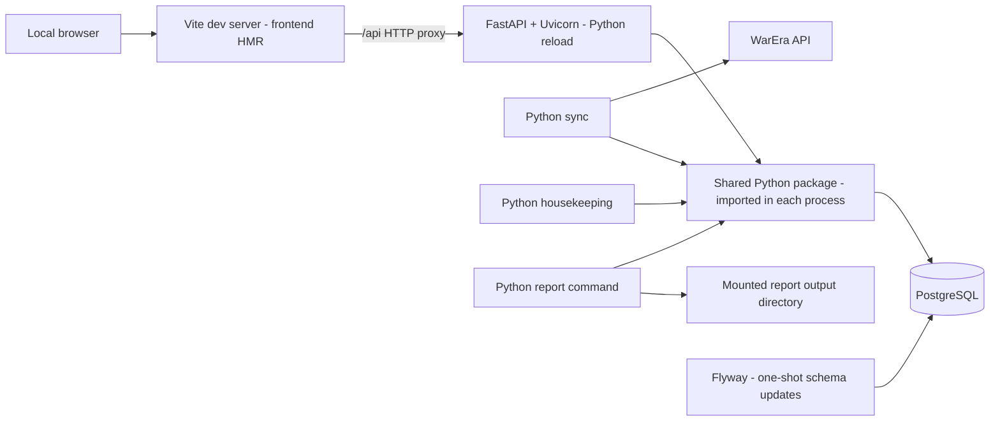

# WarEra Market Guide: web platform migration

Status: **Draft for user review. Implementation is not authorized by creation of this document.**

Date: 2026-09-06

Revision: shared Python backend and explicit development/test workflow. The user accepted one shared Python package; specific framework recommendations remain reviewable. This document describes future migration work; the current application remains Python/SQLite. Its current report behavior is documented in README.md.

Delivery boundary: **local development is this phase's deliverable; production portability is a constraint; public hosting architecture is a later decision.** No production reverse proxy, TLS provider, or hosting-specific deployment stack is selected.

## 1. Purpose and authority

Migrate the existing Python/SQLite project into a locally deployable PostgreSQL-backed market-data platform with a Python web API and a TypeScript interactive web explorer. The API, sync, housekeeping, and reports reuse one shared Python package for database access, read models, and analytics. Preserve independent report execution. Keep the platform suitable for a future strategy worker without implementing that worker in this phase.

This document is the proposed project definition and technological basis for future implementation workers. After user review, update its status and record any amendments before using it as the implementation baseline. Explicit user decisions take precedence. Recommendations and measurement gates below must not be misrepresented as already validated implementations.

Existing domain rules remain authoritative: see [project goal](project-goal.md), [market semantics](market-data-model-spec.md), [report semantics](market-reporting-liquidity-spec.md), and [AGENTS.md](../AGENTS.md). This draft proposes replacing SQLite with PostgreSQL and extending the architecture to multiple runtimes; it does not silently override current repository instructions. The approved migration must update affected instructions and documentation together with implementation.

## 2. Agreed scope

### In scope

- PostgreSQL migration with preservation and validation of existing market history.
- Independent, regularly scheduled Python synchronization.
- Independent housekeeping, coordinated with synchronization against overlap.
- Python read API and TypeScript interactive web application, with no browser database access.
- One shared Python implementation of database access and market semantics across backend processes.
- Automatic development source updates without image rebuilds for ordinary source edits.
- Real completed-trade charts, market exploration, and basic drawing tools.
- Configurable collection and browser refresh behavior; defaults selected after measurements.
- Existing Python reports runnable independently through CLI or scheduling.
- Docker Compose on the user's Windows machine using Linux service containers.
- Repeatable image builds, dependency maintenance, vulnerability scanning, and documented updates.
- Portable frontend build artifacts and Python service images, with measurements to inform a later hosting decision.

### Out of scope

- Web-triggered report jobs, report status pages, or web report downloads.
- RabbitMQ, Redis, Kubernetes, and distributed job orchestration.
- Trading strategies, backtest sweeps, trading bots, paper portfolios, or alert delivery.
- Player positions, balances, personalized portfolio advice, accounts, and cross-device drawing synchronization.
- Game order execution or integration with unsupported trading endpoints.
- A wholesale Python-to-TypeScript rewrite.
- Purchasing hosting or publishing the application as part of this planning task.
- Selecting or implementing a production web server/reverse proxy, TLS termination, hosting platform, or public deployment topology.

There is no requirement to test thousands of strategies. Future algorithmic trading informed the language choice only.

## 3. Technology baseline

The following specific libraries are architectural recommendations for review, not claims that the user previously selected them. Pin compatible supported stable versions during implementation; do not use floating production `latest` tags or prereleases by default.

| Area | Proposed technology | Rationale |
|---|---|---|
| Frontend | React + TypeScript + Vite | Static client application with a separate API; no server-side rendering requirement |
| Financial charts | KLineChart core | Free open-source financial chart library with drawing overlays |
| API | FastAPI + Uvicorn, Python | Typed HTTP contracts and direct reuse of the shared Python package |
| Shared backend | Existing `warera_quant` package, extended with API/application entry points | One implementation of storage, read models, and analytics; independently runnable consumers |
| Database | Supported stable PostgreSQL | Shared market facts, operational metadata, and canonical query interfaces |
| Python database access | Psycopg 3 behind the store boundary | Preserve the existing application layers while replacing SQLite access |
| Analytics and reports | Existing Python package and rendering dependencies | Preserve market behavior and report output; enable later Python strategies |
| Deployment | Docker Compose | Separate services on one machine, portable to a small server |
| Local frontend serving | Vite development server in the web container | Frontend HMR and same-origin `/api` proxy to the Python service |
| Future frontend hosting | Deferred to hosting selection | May use platform-provided static hosting, routing, and TLS; no proxy product required now |
| Schema management | Flyway Community with versioned SQL files and a dedicated migration container | Migration history, checksum validation, and one schema authority for all backend processes |
| Development | Vite HMR; synchronized Python source with editable installs and API reload | Fast edits without rebuilding images or publishing a shared package |

Use Flyway Community for schema migrations, including local development. Use Vite for local frontend serving and API proxying. Production frontend serving, reverse proxying, and TLS are deferred until hosting is selected; no Caddy or equivalent production proxy is part of this phase. Exact compatible stable versions and image digests for in-scope tools are pinned during implementation. No application replica may independently invent or auto-upgrade the schema on startup.

Flyway runs only as the one-shot migration service, not inside the Python API or as an always-on Java service. Store reviewed PostgreSQL SQL files under `db/migrations/`, using names such as `V001__create_market_tables.sql`. Use its history/checksum validation and migration locking; keep validation enabled, disallow out-of-order application, disable `clean`, and do not automate `repair` or baseline adoption to bypass a failure. The workflow must work using Community capabilities without a paid subscription. Its separate image/runtime is an accepted build-size cost for a mature SQL migration workflow; it creates no second application query layer.

Locally, Vite proxies `/api` and `/api/*` to Uvicorn without stripping the API prefix. Route API traffic before the frontend SPA fallback so an unknown API route never returns `index.html`. Use HTTP on a localhost-bound port. Verify that Vite builds deployable static assets, but do not add a production serving container merely to test the build. Vite's development server is not a future public-hosting recommendation.

Node.js is frontend development/build tooling, not a deployed backend API. Fastify and node-postgres are not part of this baseline. Psycopg and explicit SQL are recommendations, not a ban on an ORM or query builder: any future choice must stay inside the same Python storage boundary and preserve one schema authority. Bounded queries mean capped results, date ranges, and execution time regardless of the library used.

### Chart recommendation and validation gate

KLineChart is the preferred fit for this project's combination of free local use, custom data, candlesticks, and basic drawings. Its core repository is Apache-2.0 licensed; its overlay documentation describes horizontal lines, segments, rays, and interaction callbacks. This is a project-specific recommendation, not a universal ranking of chart tools.

TradingView Lightweight Charts is the fallback if the proof fails, with explicit estimation of the extra drawing integration effort. TradingView Advanced Charts is not the baseline because its proprietary access conditions do not fit an unconditional local/personal-use dependency.

Before building the full explorer, prove against a pinned stable KLineChart release:

1. Load a real WarEra item with sparse and fractional-price data.
2. Pan, zoom, change timeframe, and load earlier history without resetting exploration.
3. Create, select, move/edit, and delete a horizontal level and two-anchor trendline.
4. Restore drawings after reload using timestamp/price anchors, not array indexes.
5. Update the current candle and revise recent candles without losing drawings or viewport.
6. Clearly disclose empty periods and avoid falsely implying continuous activity.
7. Confirm license notices, production build integration, and usable mouse/touch behavior.

Do not silently drop basic drawing tools if the preferred library fails. Record the failure and proposed alternative. Core library selection does not automatically authorize extra Pro products or extensions.

## 4. Local development architecture and ownership

This diagram describes the delivered local environment only. There is no production topology in this phase.

Use one repository. Each service has an independently runnable container and appropriate image/build target. Share source packages and base layers rather than copying code between images. The sync image must not require the report browser or chart-rendering packages. The report service is optional and one-shot; the web stack must work without starting it.

The shared-package box is a code boundary, not an additional network service. Backend processes import the package and use their own database connections and roles. Reports and sync do not depend on API availability. The browser communicates only through HTTP with the API and never receives SQL credentials.

Keep API, ingestion, and rendering dependencies in separate installation extras/build targets. Importing the storage/read-model modules must not import rendering or start a scheduler. Build all release consumers from the same repository revision and shared package artifact; do not publish manually versioned private-package updates during development.

| Service | Lifecycle | Ownership |
|---|---|---|
| postgres | Persistent | Durable database volume |
| migrate | One-shot before dependent services | Schema migration with exclusive migration coordination |
| web | During local development | Vite frontend server, HMR, and API proxy |
| api | Persistent | Read requests, validation, serialization, health |
| sync | Persistent scheduling loop; also one-shot command | Collection, normalization orchestration, sync bookkeeping |
| housekeeping | Scheduled loop or one-shot command | Retention and application cleanup |
| report | Manual/scheduled one-shot profile | Consistent report inputs and file rendering |

Compose health dependencies establish startup order, but services must also handle database unavailability and reconnect after restarts. Graceful shutdown must stop new work and leave recoverable state.

### Layer rules

- Python `warera_api.py` continues to own WarEra endpoint names and response parsing; `api_client.py` owns HTTP transport.
- Python store/repository modules own database access. `market_data.py` builds read models; `metrics.py` owns market analytics; chart/report modules render domain data only.
- API routes contain validation, dependency wiring, and HTTP serialization, not SQL or market formulas. Routes call shared application/read-model functions. The API must not call WarEra or spawn background operations on read requests.
- Define market selection and aggregation once inside the shared Python package. API and report callers reuse the same canonical operations where their semantics match; different display intervals are parameters, not copied implementations. Database views/functions may optimize these operations but are not required as a cross-language sharing mechanism.
- Do not move all existing Python calculations into SQL. Python remains authoritative for existing fair value, WE23, and guidance calculations.
- If a web feature needs advanced analytics, call the shared calculation when it fits the request budget, or serve versioned precomputed results when measurements justify them. Do not reimplement formulas in TypeScript. A separate analytics service or full derived-data pipeline is not a prerequisite for the explorer.
- Browser indicators are exploratory presentation. Any future official signal must have an explicit, tested authoritative calculation.
- Raw upstream responses must not be persisted as JSON or become cross-service domain contracts. JSON for normalized web responses, preferences, or future strategy parameters is a different concern.

### Request concurrency and connection ownership

Start with one synchronous storage implementation usable by CLI and API. With FastAPI, run blocking database operations in synchronous request handlers/dependencies or explicitly offload them; do not call synchronous database code directly on the async event loop. Avoid creating parallel sync/async repositories with duplicated queries merely to use async syntax.

Use bounded connection pools per process and request/operation-scoped connections and transactions. Do not reuse the current CLI store instance as a global concurrent API session. Keep advisory-lock sessions separate from request pooling. Set query timeouts and bound expensive operations. CPU-heavy analysis and rendering must not monopolize request handling; precomputation can be introduced if actual features require it.

## 5. Market data contract

Preserve these distinctions throughout PostgreSQL, APIs, charts, and reports:

- Completed transactions determine trade prices, OHLC, volume, fair-value inputs, and historical activity.
- Order-book observations determine observed executable asks/bids, depth, spread, and slippage estimates.
- The lagging game-calculated price is diagnostic/compatibility data only. It must not fill gaps in trade history or drive market guidance.
- Unknown and unavailable values remain explicit. No short selling is implied by sell guidance.

The schema must retain transaction identity, item identity, observation relationships, production configuration, and sync state. Preserve event time and collection time separately. Use UTC timestamps and an explicit API timestamp unit; document numeric precision for price, money, and quantity. Audit existing SQLite values before selecting PostgreSQL numeric precision/scale. Decimal conversion cannot restore precision already lost in historical floats.

Retain deterministic transaction IDs, including existing derived identifiers, to preserve deduplication. Stable ordering uses time plus a documented tie-breaker. Existing high-water marks must not hide missing trades when late arrivals or timestamp ties occur; validate overlap/reconciliation behavior against upstream capabilities.

### Candles and history

- Canonical OHLCV is aggregated from completed trades in UTC half-open buckets `[start, end)`.
- Open/close follow deterministic trade ordering; volume is completed quantity; trade count is available for evidence.
- Empty buckets are not fabricated trades. Return coverage information and define a chart representation that visibly discloses gaps.
- Mark the current bucket as provisional. Historical ingestion can revise an earlier candle; browser refresh must handle revisions, not only append points.
- Candle endpoints accept a supported interval, time bounds, and capped result size, with a continuation mechanism for earlier history.
- Proposed initial intervals: 15 minutes, 1 hour, 4 hours, and 1 day. These are reviewable defaults, not restrictions inherited from static report graphics.
- Do not impose the report's configurable rendering window (30 days by default) on the explorer; explore available retained history within bounded requests.
- The chart library receives normalized application data. Its proprietary object shapes must not define the database schema or public API.

## 6. Explorer requirements

### Market overview

Show a searchable item list with latest completed trade, its timestamp, latest observed best bid/ask, and a clearly labeled completed-activity window. Allow selection of an item. Keep unavailable values distinct from zero. Avoid introducing new ranking or trading formulas during this migration.

### Item exploration

Show candles, completed volume, timeframe controls, pan/zoom, crosshair values, and a latest-data action. Show current observed order-book levels/depth and observation age separately. Provide loading, no-history, API-error, partial-data, and stale-data states.

Basic drawing tools are required. Proposed minimum: horizontal price level and two-anchor trendline with creation, selection, editing/moving, and deletion. Persist drawings per item in browser-local storage using a versioned application representation with timestamps and prices. Drawings should survive timeframe changes where anchors remain meaningful. Handle unavailable historical anchors gracefully.

Browser-local persistence is a proposed first-release simplification: drawings do not follow users across devices and may disappear if local storage is cleared. Drawing on a chart creates no alert, server strategy, or game order.

The report-only PNG table rules do not prohibit interactive tables/charts in the web explorer. Exported report tables must still meet those rules.

### API and refresh

Provide versioned read endpoints for item discovery/overview, item candles, latest order book, and data freshness. Publish an OpenAPI contract with validation, errors, pagination, timestamp units, nullable fields, and numeric serialization rules. Health endpoints distinguish process liveness from database readiness.

Use configurable browser polling initially. Pause or reduce background-tab polling and refresh on return. Bound queries and use conditional responses/revisions where useful. A page refresh must not trigger upstream ingestion. SSE is a future optimization if measurements justify it; WebSockets are not required.

## 7. Synchronization and housekeeping

Synchronization is independent of report generation. Preserve incremental ingestion and explicit backfill as distinct operations. Startup of a report or website must never implicitly launch an unbounded backfill.

Configuration must separate:

- Sync scheduling interval.
- Upstream request pacing, request timeout, retry limits, and backoff.
- Browser refresh interval.
- Data-staleness threshold.
- Retention policy and housekeeping schedule.

Measure incremental sync duration, request counts, throttling behavior, and data publication delay before choosing defaults. Do not promise seconds-level freshness without evidence. Respect upstream limits, use bounded retries and supported retry hints, and expose item-level errors.

Record run IDs, start/end times, state, per-item collection times, inserted/duplicate counts, and errors. The last successful data time must not advance on a failed run; partial completion must remain visible. Do not give every item the run-start time as if it were its actual collection time.

### Concurrency policy

| Operations | Initial rule |
|---|---|
| Sync / sync, including backfill and manual runs | Mutually exclusive |
| Housekeeping / housekeeping | Mutually exclusive |
| Sync / application housekeeping | Mutually exclusive |
| Web reads / writes | Concurrent, using committed data |
| Report input capture / writes | Consistent database snapshot |
| Report rendering / writes | Concurrent after input capture |

Use the same PostgreSQL advisory-lock protocol for every invocation path, on a dedicated session rather than an arbitrary pooled connection. Do not keep a large database transaction open across upstream HTTP calls. Loss of lock ownership/database session must abort further work; restart recovery must reconcile interrupted runs.

When a scheduled tick finds work in progress, skip/defer it rather than enqueue unlimited catch-up runs. Make manual lock contention explicit through a documented exit result or bounded wait. PostgreSQL internal autovacuum is not application housekeeping and must not be disabled by this policy.

The existing `--live` option may remain only as a documented compatibility wrapper over the same sync and report application operations. Define behavior when sync fails or cannot acquire its lock; never silently represent an old report as freshly synchronized.

## 8. Independent reports

Preserve current report semantics and supported output assets: HTML, CSV audit data, chart PNGs, table PNGs, header and item cards. Automatic PNG publication and the asset inventory remain supported; retain compatibility flags and optional all-item/research exports. Reports read PostgreSQL without calling WarEra and write to a mounted durable output directory.

Capture report inputs under a consistent snapshot and release it before browser rendering. Record generation time separately from input freshness and partial-sync state. Use distinct run directories or equivalent publication protection so concurrent scheduled/manual reports cannot corrupt each other's files.

ZIP packaging and a standalone HTML with embedded assets are optional follow-up conveniences, not first-phase acceptance requirements. Reports need no artifact database, object store, web endpoint, queue, or persistent worker. Exported PNG tables must contain the complete tightly cropped table, with legible intrinsic sizing and no clipping or scrolling.

## 9. Retention and historical evidence

Current housekeeping retains 120 days while the active WE23 index depends on a fixed inception and a preceding 28-day weighting window. The older fixed-vintage inflation overview is retired from CLI publication. Do not port deletion behavior without protecting the evidence required to reconstruct active indices.

Before enabling PostgreSQL deletion, classify retention separately for completed transactions, order-book snapshots/levels, diagnostic prices, operational logs, and report files. Protect the source transactions required by active WE23 inception/weighting windows and any explicitly retained legacy research baselines. A later compact baseline representation requires a separate auditable design and parity validation.

Measure daily storage growth. Order-book levels may dominate growth. Retention must support current report windows and warm-up needs while disclosing that deleted history cannot be recreated locally. A failed or missing retention configuration must not cause aggressive deletion.

## 10. Local container maintenance and production portability

- Pin supported base images and application lockfiles; use separate minimal runtime targets and multi-stage builds where appropriate.
- Keep credentials out of images, browser bundles, logs, and version control. The web API does not need the WarEra API key.
- Use separate least-privilege database roles for migration, ingestion, cleanup, and reads.
- Bind local entry points to localhost by default. Keep PostgreSQL internal, with optional local-only development exposure.
- Run application containers without root where practical; avoid Docker socket mounts and runtime package installation.
- Automate update proposals for Node/Python dependencies, base images, and CI actions. Rebuild and rescan regularly even when application code is unchanged.
- Scan OS and language dependencies, including report browser packages. Record findings and remediation; never claim scans prove absence of vulnerabilities.
- Build and test versioned local image artifacts and record their digests. Document local updates and rollback rather than unattended floating-tag upgrades. Public registry publication and hosted deployment are not required in this phase.
- Treat PostgreSQL major upgrades separately from ordinary image refreshes. Back up and test restoration before destructive migrations.
- Persist database and report outputs outside container writable layers. A named volume is persistence, not a backup.
- Provide structured logs with run/request identifiers, bounded log retention, health checks, and visible last-success/error information.

Proposed maintenance default: weekly update checks and image rescans, with expedited review for relevant high/critical findings. Select concrete tools based on repository CI availability and cost during implementation.

Record CPU, memory, disk growth, and modest concurrent API load locally. A future hosting comparison can price a small Linux server against managed alternatives, including static frontend hosting and platform-provided routing/TLS. Do not assume that production will reproduce the Compose topology. Include backup storage, traffic, taxes, and operational responsibility when that comparison is requested. Reports may remain local. No provider, proxy product, monthly budget, or public performance capacity is established yet.

Future public-release requirements, not current deployment tasks: decide HTTPS termination, public rate limits, routing and static hosting with the chosen platform; verify secret handling, backup/restore, and upstream data-publication permissions. Never expose administrative sync or cleanup controls publicly. Local secret handling, bounded API queries, and backup/restore checks remain required now. Accounts remain unnecessary for anonymous read-only exploration.

### Development loop: source edits without image rebuilds

Provide a documented local Compose configuration and one start command that checks prerequisites, starts PostgreSQL, explicitly runs pending migrations, and starts Vite/API source watching. Also provide one documented migration command for later schema edits. A development override is optional if it helps structure local test configurations; do not require a production Compose stack just to provide development overrides. Built Python image tests run without source mounts or reload/watch processes.

Use Compose Watch source synchronization with initial synchronization and Python editable installs at the synchronized path. Watch the API and the entire shared package, not only route files. An equivalent bind-mount setup is acceptable if verified on the user's Windows/Docker Desktop environment; do not configure Watch and bind mounts over the same source path. Keep host `.venv`, `node_modules`, database data, generated reports, and caches out of synchronization; dependencies live in the container environment. Verify actual Windows file-change detection, using polling if necessary.

| Edit | Required development behavior |
|---|---|
| Frontend source/styles | Vite HMR updates the browser |
| API or shared Python source | Synchronize source; Uvicorn reloads once; the next request uses the edit |
| Shared source used by a worker | Next fresh operation uses current synchronized source; active operation follows the safe policy below |
| Report source | Next report process uses current source; no stale installed package copy |
| Python/Node dependency manifests, lockfiles, or package metadata | Automated affected-image rebuild/reinstall and recreation through the development workflow |
| Dockerfile or OS dependency | Rebuild affected targets explicitly or through a documented watcher rule |
| SQL migration | Run the migration command; source reload does not apply schema changes |

Do not use two restart mechanisms for the API simultaneously: source sync plus Uvicorn reload is sufficient. Synchronization alone does not replace modules already imported by a Python process.

For development sync/housekeeping/report operations, use a fresh Python process per invocation. Default worker operation to manual during code editing. For automatic scheduling, stage source changes until the current operation completes, or stop it gracefully and restart only after termination; the database lock still governs all invocations. Do not assume a process is insulated from edits because some modules were already imported: late imports can see changed files. The development workflow must avoid updating its active source tree mid-operation. Report rendering may finish using a fixed per-run source snapshot; otherwise defer synchronization until completion. Production images naturally provide fixed source.

Dependency rebuilds must update all affected consumers, but image build order is not a manual developer responsibility. Independent service images install the same source/package revision without relying on another service having been built first. Document and automate any actual build dependencies.

Acceptance: saving a shared query edit changes the next API result and next worker invocation without manual image rebuilds or shared-package publication; an in-progress sync remains coherent and cannot overlap its replacement. Verify this workflow with a controlled fixture and visible logs, including initial startup and a dependency edit.

### Testing and release-artifact validation

- Run pure Python/unit tests from the existing host `.venv` against the working source; use an editable install if needed rather than recreating the environment. Also offer a container test command using the same source.
- Run storage, migration, and concurrency tests against a dedicated disposable PostgreSQL database/volume. Never reset the developer's collected market database. Use explicit test connection configuration and safeguards against targeting non-test data.
- API integration tests call the same shared package and verify HTTP serialization, validation, query bounds, and transaction cleanup; mocks alone are insufficient for storage behavior.
- Browser tests cover real development frontend/API integration, drawings, sparse history, and refresh preservation using deterministic test data rather than upstream API access.
- Test shared numerical/query semantics centrally and test consumer contracts at their boundaries; sharing source does not eliminate interface regression tests.
- CI additionally installs the regular built package into immutable Python service images and runs a local Compose smoke test, without editable installs or source mounts for those images. Verify required modules and dependency extras are packaged correctly. Build the frontend and validate its artifacts; any local preview used to smoke-test them is test tooling, not a selected production web server. No production reverse proxy or public TLS setup is required for acceptance.
- Expose the repository revision/package version in service diagnostics for release mismatch detection. Production uses compatible images built from the same revision; source hot reload is development-only.

### Ongoing PostgreSQL schema migrations

Schema evolution is a permanent architectural mechanism, distinct from the one-time SQLite-to-PostgreSQL project migration. Use an established SQL-first runner with ordered migration files, a database history table, checksums, and exclusive migration locking. Applied migrations are immutable; fixes are new migrations. Keep migration credentials separate from runtime roles.

Deployment/start tooling explicitly runs the migration job and checks its success before activating dependent application versions. Do not rely on an old, already-successful Compose container being rerun automatically for every release. A migration lock serializes migration runners but does not itself stop ingestion or web requests: pause incompatible consumers when needed and use lock/statement timeouts. Application startup/readiness checks schema compatibility without applying DDL.

Prefer transactional migrations. Document exceptions such as operations requiring execution outside a transaction, including failure recovery. Large data backfills are separate resumable batch operations, not long startup transactions. Test upgrades from the previous supported schema as well as creation of an empty database; checksum mismatches and failed migrations must stop activation.

Use expand/migrate/contract for incompatible changes: add compatible structure, deploy compatible code, backfill and verify, switch readers/writers, then remove old structure after the rollback window. Ordinary source edits need no service ordering; schema-breaking changes do. Prefer corrective forward migrations and compatible application rollback to automatic destructive down-migrations. A restore procedure must account for data collected after the backup.

## 11. Migration stages and acceptance gates

### M0: baseline and chart feasibility

Inventory current schema, data size, authentic historical coverage, report behavior, and existing tests. Capture representative numerical and visual outputs with fixed input times/configuration. Measure normal incremental sync and report resource usage. Complete the chart proof from section 3. Record chosen stable versions and remaining decisions.

### M1: reusable operations and database contracts

Extract CLI orchestration only where needed into reusable sync/report/cleanup application entry points. Preserve calculations and rendering. Define one migration authority and shared Python storage/read-model contracts. Update approved architecture instructions to reflect the storage change and thin Python API boundary. Establish dependency extras, the development Compose workflow, editable source loading, and safe worker refresh before full feature implementation.

Acceptance: existing Python behavior remains equivalent before changing production storage; no copied formulas or API parsing. API and CLI prototypes import the same package implementation. Shared-source reload and the next fresh worker operation work without manual image rebuilding.

### M2: PostgreSQL import and report parity

Build a repeatable importer from a consistent SQLite backup into PostgreSQL. Keep SQLite access in its designated adapter; do not distribute SQLite imports across migration callers. Transfer identities, foreign keys, production configuration, sync metadata, and timestamps; reconcile sequences and constraints. Keep PostgreSQL inactive as an ingestion writer during rehearsal.

Acceptance: reconcile counts, IDs, time ranges, totals, relationships, duplicates, nulls, and representative analytical outputs. Declare justified numeric tolerances; do not silently loosen tests. Verify report visual content and complete PNG bounds rather than relying on byte-identical browser images.

### M3: unattended data services

Deliver Compose database/migration/sync/housekeeping services, scheduling, shared locks, backoff, failure recovery, freshness, retention protection, and backup/restore instructions.

Acceptance: manual and scheduled concurrency cannot overlap; restart/connection-loss scenarios recover; partial failure does not falsify freshness; repeated ingestion is idempotent; cleanup preserves protected evidence.

### M4: API and interactive explorer

Deliver the Python read API, market overview, item explorer, basic drawings, bounded history loading, and automatic refresh. Test API and report use of shared query/read-model operations and frontend conformance to the OpenAPI contract.

Acceptance: API candles agree with canonical transaction fixtures including tied timestamps, empty periods, and late data. Drawings survive reload/timeframe changes. Updates preserve the viewport. Stale and missing data are visible. No web request calls WarEra.

### M5: independent report operation and maintenance pipeline

Deliver the optional report container and documented manual/scheduled invocation, artifact persistence, image update/scanning pipeline, and full Compose smoke verification.

Acceptance: reports succeed with ingestion stopped, the web stack operates without report dependencies, outputs survive container removal, and a tested release can be rolled forward/back within schema compatibility constraints.

### M6: local database cutover and portability measurements

Prefer a brief ingestion pause: stop the SQLite writer, create a consistent backup, perform a validated final transfer, then enable the sole PostgreSQL writer. Avoid long-lived dual writes. Preserve the old database read-only during the rollback window.

Rollback must account for transactions collected after cutover; simply reverting a connection string would lose that history. Prefer rolling back application images against a compatible PostgreSQL schema; define any required data export/reconciliation before activation.

Acceptance: the local application uses PostgreSQL, restore rehearsal succeeds, and resource measurements and artifact build instructions are recorded for a later hosting assessment. Completing this phase requires no hosting provider, public budget decision, reverse proxy, TLS setup, or internet deployment.

## 12. Future strategy worker boundary

A future Python strategy worker may consume committed market data plus optional player capital/positions, derive its own entry prices, sizes, exits, and risk limits, and emit trade instructions. Alerts would be an output channel, not the definition of the strategy engine.

No framework is selected now. NautilusTrader, LEAN, and research libraries may be evaluated separately. Do not add their schemas, services, dependencies, or event brokers in this phase. Normalized data, deterministic timestamps, reusable analytics, and sync checkpoints are sufficient preparation.

Future advisory instructions, simulated fills, and confirmed player trades must remain distinct. Unsupported game execution remains unavailable.

## 13. Review decisions and implementation guidance

No further user information is required to review this definition. The following are proposed defaults or later measurements, rather than hidden blockers:

| Decision | Current treatment |
|---|---|
| One shared Python backend package and Python API | Accepted architectural direction; no Node database layer or browser SQL |
| KLineChart, React/Vite, FastAPI/Uvicorn, Psycopg | Recommended specific libraries for this review |
| Development reload and test workflow | Required: ordinary source edits need no manual image rebuild; verify safe worker handling |
| Drawings and persistence | Horizontal levels/trendlines; browser-local persistence proposed |
| Intervals | 15m, 1h, 4h, 1D proposed; verify with actual data |
| Sync/refresh/stale thresholds | Configurable; select after measurements |
| Migration runner | Flyway Community; required for local schema evolution |
| Local frontend entry point | Vite with `/api` proxy; no production proxy container |
| Production serving, reverse proxy, and TLS | Deferred to future hosting selection; platform-provided facilities may suffice |
| Exact versions and CI tooling | Record during M0/M1 without broadening scope |
| Retention durations | Measure; preserve report and WE23 evidence before cleanup |
| Public load target and monthly budget | Establish before selecting hosting |

Future implementation workers must work stage by stage, report validation evidence, and distinguish completed work from proposals. Reuse the existing `.venv` for host-side Python tests. Add meaningful PostgreSQL integration, concurrency/recovery, API contract, and browser interaction checks. Do not introduce tests that merely mirror implementation details. Do not implement future alerts, report web jobs, or new strategy formulas as incidental migration work.

## 14. Technology references

Reviewed on 2026-09-06; recheck version-specific APIs and license terms when pinning dependencies.

- [KLineChart repository and license](https://github.com/klinecharts/KLineChart)
- [KLineChart overlay capabilities](https://klinecharts.com/en-US/guide/overlay.html)
- [TradingView chart-library comparison](https://www.tradingview.com/free-charting-libraries/)
- [TradingView Advanced Charts introduction and access conditions](https://www.tradingview.com/charting-library-docs/latest/introduction/)
- [Vite guide](https://vite.dev/guide/)
- [FastAPI synchronous/async request handling](https://fastapi.tiangolo.com/async/)
- [Uvicorn reload settings](https://www.uvicorn.org/settings/)
- [Psycopg 3 documentation](https://www.psycopg.org/psycopg3/docs/)
- [Docker build and maintenance guidance](https://docs.docker.com/build/building/best-practices/)
- [Compose Watch source synchronization and rebuilds](https://docs.docker.com/compose/how-tos/file-watch/)
- [Python editable versus regular installs](https://pip.pypa.io/en/stable/topics/local-project-installs/)
- [Flyway Community repository](https://github.com/flyway/flyway)
- [Flyway checksum validation](https://documentation.red-gate.com/flyway/reference/commands/validate)
- [Flyway Docker deployment](https://documentation.red-gate.com/fd/flyway-docker-321585710.html)
